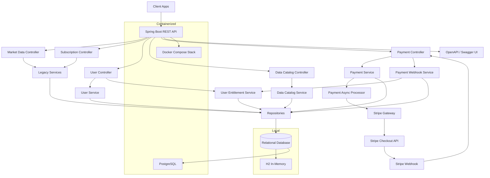

# Spring Boot Java Refresh

This project is a REST API backend service built with Spring Boot for market data delivery, user management, data product cataloging, and asynchronous Stripe-backed payment flows. The service uses H2 database for local development and PostgreSQL for containerized deployments.

## Features

- REST API compatible with OpenAPI specification
- Market Data management (CRUD operations)
- Legacy subscription management for Market Data
- User management with profile fields such as email, first name, last name, company, country, and phone number
- Data Catalog service for listing and managing purchasable data products
- User entitlement tracking for subscription and one-time product access
- Asynchronous Stripe checkout session creation and webhook-based payment completion
- H2 in-memory database for local development
- PostgreSQL database for production
- Docker containerization
- Comprehensive unit tests

## Core Flows

- Catalog administrators create `DataProduct` records that define price, currency, purchase mode, and billing interval.
- Clients create `User` records and query `/api/catalog/products` to discover available offerings.
- Checkout requests create `PaymentTransaction` records immediately and then start Stripe session creation asynchronously.
- Stripe webhooks finalize payments and grant `UserEntitlement` access for subscriptions and one-time purchases.

## Prerequisites

- Java 21 or higher
- Maven 3.6+
- Docker and Docker Compose (for production database)

## Getting Started

### Local Development (H2 Database)

1. Clone the repository
2. Run `mvn clean install` to build the project
3. Run `mvn spring-boot:run` to start the service
4. Run `mvn test` to execute unit tests

The service will be available at `http://localhost:8080`

### Production Setup (PostgreSQL Database)

1. Run `docker-compose up -d` to start the PostgreSQL database
2. Update `application.properties` to use PostgreSQL configuration
3. Run `mvn clean package` to build the JAR
4. Run `java -jar target/spring-boot-java-refresh-0.0.1-SNAPSHOT.jar`

### Stripe Configuration

Set the following properties before using payment endpoints against Stripe:

- `stripe.api-key` for checkout session creation
- `stripe.webhook-secret` for verified webhook processing

If `stripe.webhook-secret` is left blank, webhook payloads can still be parsed for local testing, but signature verification is skipped.

## API Endpoints

### Market Data

- `GET /api/market-data` - Get all market data
- `GET /api/market-data/{id}` - Get market data by ID
- `GET /api/market-data/symbol/{symbol}` - Get market data by symbol
- `POST /api/market-data` - Create new market data
- `DELETE /api/market-data/{id}` - Delete market data by ID

### Subscriptions

- `GET /api/subscriptions` - Get all subscriptions
- `GET /api/subscriptions/{id}` - Get subscription by ID
- `GET /api/subscriptions/user/{userId}` - Get subscriptions by user ID
- `POST /api/subscriptions` - Create new subscription
- `DELETE /api/subscriptions/{id}` - Delete subscription by ID

### Users

- `GET /api/users` - Get all users
- `GET /api/users/{id}` - Get user by ID
- `POST /api/users` - Create a new user
- `GET /api/users/{id}/entitlements` - Get user entitlements

### Data Catalog

- `GET /api/catalog/products` - Get all products
- `GET /api/catalog/products?activeOnly=true` - Get active products only
- `GET /api/catalog/products/{id}` - Get product by ID
- `GET /api/catalog/products/code/{code}` - Get product by code
- `POST /api/catalog/products` - Create a catalog product

### Payments

- `POST /api/payments/checkout` - Start an asynchronous Stripe checkout flow
- `GET /api/payments/{id}` - Get payment transaction status
- `POST /api/payments/webhook` - Receive Stripe webhook events

### Example Commerce Flow

1. Create a user with `POST /api/users`.
2. Create or query catalog products with `POST /api/catalog/products` or `GET /api/catalog/products`.
3. Start checkout with `POST /api/payments/checkout`.
4. Poll `GET /api/payments/{id}` until Stripe session creation completes.
5. Let Stripe call `POST /api/payments/webhook` to mark the transaction successful and grant entitlements.

## API Documentation

The API is documented using OpenAPI 3.0. Access the Swagger UI at `http://localhost:8080/swagger-ui.html` when the service is running.

## Database Configuration

### Local Development (H2)
- URL: `jdbc:h2:mem:marketdata`
- Console: `http://localhost:8080/h2-console`

### Production (PostgreSQL)
- URL: `jdbc:postgresql://localhost:5432/marketdata`
- Username: `postgres`
- Password: `password`

## Domain Model

- `User` stores the customer identity and contact fields used by the commerce flow.
- `DataProduct` represents a sellable data offering, including code, price, currency, access type, and billing interval.
- `PaymentTransaction` tracks asynchronous checkout creation and final payment status.
- `UserEntitlement` records which products a user can access, whether acquired as a recurring subscription or one-time purchase.

## Architecture



## Project Structure

```
src/
├── main/
│   ├── java/
│   │   └── com/example/springbootjavarefresh/
│   │       ├── controller/     # REST controllers
│   │       ├── entity/         # JPA entities
│   │       ├── repository/     # Data repositories
│   │       ├── service/        # Business logic
│   │       └── SpringBootJavaRefreshApplication.java
│   └── resources/
│       ├── application.properties
│       └── data.sql
└── test/                      # Unit tests
```

## Testing

Run unit tests with:
```bash
mvn test
```

The Dockerized Java 21 test workflow is also verified:
```bash
./scripts/test.sh
```

Current automated coverage includes:
- Controller tests for market data, subscriptions, users, catalog, and payments
- Service tests for market data, subscriptions, user creation, catalog creation, entitlement grants, payment initiation, asynchronous checkout, and webhook completion paths
- Full Spring Boot startup test against the H2 configuration

## Building for Production

```bash
mvn clean package
java -jar target/spring-boot-java-refresh-0.0.1-SNAPSHOT.jar
```

## Docker

Build and run with Docker:
```bash
docker build -t spring-boot-java-refresh .
docker run -p 8080:8080 spring-boot-java-refresh
```

Or use the helper scripts in `scripts/`:
```bash
./scripts/build.sh
./scripts/run.sh
./scripts/test.sh
./scripts/logs.sh app
./scripts/shutdown.sh
```

Verified workflow:
- `./scripts/build.sh` builds the Java 21 Docker image
- `./scripts/run.sh` starts PostgreSQL and the app with Docker Compose
- `./scripts/test.sh` runs the Maven test suite in a Java 21 container
- `./scripts/logs.sh app` tails container logs
- `./scripts/shutdown.sh` stops and removes the stack

The Docker image builds with Maven in a build stage and runs on Java 21 JRE in the final stage.

## Contributing

Please read CONTRIBUTING.md for details on our code of conduct and the process for submitting pull requests.

## License

This project is licensed under the MIT License - see the LICENSE file for details.
