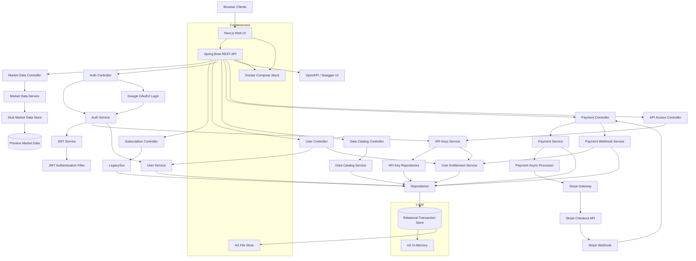

# Market Data Lake

Market Data Lake is a Spring Boot backend with a separate Next.js web UI for market data delivery, user management, JWT-based authentication, Google OAuth2 sign-in, API key access control, data product cataloging, asynchronous Stripe-backed payment flows, and administration. Delta Lake is currently isolated from active runtime, development, and deployment while market-data endpoints are served from a preview stub and transactional application state stays in H2.

## Features

- REST API compatible with OpenAPI specification
- Market Data management (CRUD operations)
- Legacy subscription management for Market Data
- User management with profile fields such as email, first name, last name, company, country, and phone number
- Full authentication system with password hashing, email verification, Google OAuth2 sign-in, JWT bearer tokens, and stateless security filters
- Data Catalog service for listing and managing purchasable data products
- User entitlement tracking for subscription and one-time product access
- API key issuance for user registration and login flows
- API key usage tracking with per-product quota enforcement for batch downloads and realtime subscriptions
- Usage history tables that can later support billing, forecasting, and audit reporting
- Asynchronous Stripe checkout session creation and webhook-based payment completion
- Preview market-data stubs for runtime and development
- H2 database for transactional local development and containerized runtime
- Separate Next.js web UI running in its own Docker container
- Docker containerization
- Comprehensive unit tests

## Documentation

- [Architecture Overview](./ARCHITECTURE.md)
- [Architecture Decision Records](./docs/adr)
- [Architecture Diagrams](./docs/diagrams/architecture-overview.md)

## Core Flows

- Catalog administrators create `DataProduct` records that define price, currency, purchase mode, and billing interval.
- Catalog administrators can also define quota limits such as batch download megabytes, realtime subscription counts, and payload caps.
- Clients create `User` records and query `/api/catalog/products` to discover available offerings.
- Credential-based registration sends an email verification link first, and verified users can then log in to receive a JWT for management APIs and an API key for downstream data access.
- Google sign-in uses Spring Security OAuth2 login, links or creates a local user, and then issues the same application JWT and API key pair used by password-authenticated users.
- Checkout requests create `PaymentTransaction` records immediately and then start Stripe session creation asynchronously.
- Stripe webhooks finalize payments and grant `UserEntitlement` access for subscriptions and one-time purchases.
- API access registration and login flows mint API keys for users, and each usage event is written into dedicated usage tables while entitlement limits are enforced.
- The Next.js web UI consumes the backend REST API for signup, signin, catalog browsing, checkout polling, entitlement inspection, and admin audit workflows.

## Prerequisites

- Java 21 or higher
- Maven 3.6+
- Docker and Docker Compose

## Getting Started

### Local Development

1. Clone the repository
2. Run `mvn clean install` to build the project
3. Run `mvn spring-boot:run` to start the service
4. Run `mvn test` to execute unit tests

The service will be available at `http://localhost:8080`

Local execution uses:
- H2 for transactional application state
- an in-memory preview stub for market-data responses

### Containerized Runtime

1. Run `docker-compose up -d` or `./scripts/run.sh`
2. Transactional application state is stored in an H2 file mounted at `/data/h2/market-data-lake`
3. Market-data endpoints are served from the in-memory preview stub
4. The separate web UI is available at `http://localhost:3000`
5. Local email capture is available at `http://localhost:8025` through Mailpit

### Stripe Configuration

The application now reads Stripe settings from environment variables, and the local helper scripts automatically load them from `.env`.

Set these sandbox values in `.env` before using payment endpoints:

- `STRIPE_API_KEY` for Stripe test-mode checkout session creation
- `STRIPE_WEBHOOK_SECRET` for verified webhook processing
- `APP_BASE_URL` and `SERVER_PORT` for local callback routing

Local sandbox webhook flow:

1. Start the application locally on `http://localhost:8080`.
2. Run `./scripts/stripe-listen.sh`.
3. Stripe CLI will expose a reachable forwarding tunnel to `POST /api/payments/webhook`.
4. Copy the signing secret printed by Stripe CLI into `STRIPE_WEBHOOK_SECRET` in `.env` if needed.

The webhook endpoint used by local forwarding is:

- `POST /api/payments/webhook`

If `STRIPE_WEBHOOK_SECRET` is left blank, webhook payloads can still be parsed for local testing, but signature verification is skipped.

### Authentication Configuration

JWT signing is configured with:

- `security.jwt.secret`
- `security.jwt.expiration-hours`

Email verification and SMTP are configured with:

- `app.auth.verification-base-url`
- `app.auth.verification-expiration-hours`
- `app.mail.from`
- `spring.mail.host`
- `spring.mail.port`
- `spring.mail.username`
- `spring.mail.password`

Google OAuth2 login is configured with:

- `app.auth.oauth2.success-url`
- `app.auth.oauth2.failure-url`
- `app.auth.google.client-id`
- `app.auth.google.client-secret`
- `app.auth.google.scopes`

For local Google sandbox-style testing:

1. Create a Google OAuth client in Google Cloud Console.
2. Add `http://localhost:8080/login/oauth2/code/google` as an authorized redirect URI.
3. Set `GOOGLE_CLIENT_ID` and `GOOGLE_CLIENT_SECRET` in `.env`.
4. Keep `APP_AUTH_OAUTH2_SUCCESS_URL=http://localhost:3000/oauth/callback`.
5. Start the stack and use `Continue with Google` in the UI.

In Docker runtime, Mailpit is started automatically for local verification testing:

- SMTP: `localhost:1025`
- Mail UI: `http://localhost:8025`

All management endpoints are protected by bearer authentication unless explicitly documented as public.
Public endpoints include `/api/auth/**`, `/oauth2/**`, `/login/oauth2/**`, `/api/access/register`, `/api/access/login`, `/api/access/usage`, `/api/access/usage/summary`, and `/api/payments/webhook`.

### Web UI

The web UI is implemented in `frontend/` with React, Next.js, and TypeScript. It provides:

- signup, signin, and signout flows
- Google sign-in with OAuth2 callback handling in the frontend
- catalog browsing and market-data preview browsing
- Stripe checkout initiation and transaction polling
- entitlement and API key visibility for signed-in users
- administration views for dashboard, product creation, market-data insertion, and audit activity

## API Endpoints

### Market Data

- `GET /api/market-data` - Get all market data
- `GET /api/market-data/runtime` - Get the current market-data runtime mode and stub status
- `GET /api/market-data/{id}` - Get market data by ID
- `GET /api/market-data/symbol/{symbol}` - Get market data by symbol
- `POST /api/market-data` - Create a new preview market-data row in the stub runtime
- `DELETE /api/market-data/{id}` - Delete market data by ID

### Subscriptions

- `GET /api/subscriptions` - Get all subscriptions
- `GET /api/subscriptions/{id}` - Get subscription by ID
- `GET /api/subscriptions/user/{userId}` - Get subscriptions by user ID
- `POST /api/subscriptions` - Create new subscription
- `DELETE /api/subscriptions/{id}` - Delete subscription by ID

### Users

- `GET /api/users` - Get all users, requires bearer token
- `GET /api/users/{id}` - Get user by ID, requires bearer token
- `POST /api/users` - Create a new user through the management API, requires bearer token
- `GET /api/users/{id}/entitlements` - Get user entitlements, requires bearer token

### Authentication

- `POST /api/auth/register` - Register with password credentials and send an email verification link
- `GET /api/auth/verify-email?token=...` - Verify the email address for a registered user
- `POST /api/auth/resend-verification` - Reissue a verification email for an unverified password-based account
- `POST /api/auth/login` - Authenticate a verified user and receive a JWT plus API key
- `GET /api/auth/me` - Get the currently authenticated user profile
- `GET /api/auth/me/entitlements` - Get the currently authenticated user's entitlements
- `POST /api/auth/logout` - Client-side signout endpoint
- `GET /oauth2/authorization/google` - Start Google OAuth2 login and redirect to Google consent

### Data Catalog

- `GET /api/catalog/products` - Get all products
- `GET /api/catalog/products?activeOnly=true` - Get active products only
- `GET /api/catalog/products/{id}` - Get product by ID
- `GET /api/catalog/products/code/{code}` - Get product by code
- `POST /api/catalog/products` - Create a catalog product

### Payments

- `POST /api/payments/checkout` - Start an asynchronous Stripe checkout flow
- `GET /api/payments/{id}` - Get payment transaction status
- `POST /api/payments/webhook` - Receive Stripe webhook events

### API Access

- `POST /api/access/register` - Register a user with password credentials and return a new API key
- `POST /api/access/login` - Issue a fresh API key for an existing user email/password login
- `POST /api/access/usage` - Record API usage and enforce purchased limits
- `GET /api/access/usage/summary?apiKey=...&productId=...` - Query remaining quota for a key and product

### Administration

- `GET /api/admin/dashboard` - Get dashboard counts and recent audit activity, requires admin role
- `GET /api/admin/payments` - Get recent payments, requires admin role
- `GET /api/admin/usage` - Get recent usage events, requires admin role

### Example Commerce Flow

1. Register with `POST /api/auth/register`.
2. Open the verification email from Mailpit or your configured SMTP inbox and call `GET /api/auth/verify-email?token=...`.
3. Sign in with `POST /api/auth/login` to get a bearer token and API key.
4. Use the bearer token to create or query catalog products with `POST /api/catalog/products` or `GET /api/catalog/products`.
5. Start checkout with `POST /api/payments/checkout`.
6. Poll `GET /api/payments/{id}` until Stripe session creation completes.
7. Let Stripe call `POST /api/payments/webhook` to mark the transaction successful and grant entitlements.
8. Submit usage events through `POST /api/access/usage` and inspect remaining quota with `GET /api/access/usage/summary`.

### Example Google Sign-In Flow

1. Click `Continue with Google` in the web UI or open `GET /oauth2/authorization/google`.
2. Complete Google consent and return to `/login/oauth2/code/google`.
3. The backend links or creates the local `User`, marks the account as verified, and issues a JWT plus API key.
4. The backend redirects to the frontend OAuth callback page.
5. The frontend stores the returned session and resumes the signed-in UI state.

## API Documentation

The API is documented using OpenAPI 3.0. Access the Swagger UI at `http://localhost:8080/swagger-ui.html` when the service is running.

## Database Configuration

### Transactional State
- URL: `jdbc:h2:mem:marketdata` for local execution
- URL: `jdbc:h2:file:/data/h2/market-data-lake` in Docker Compose
- Console: `http://localhost:8080/h2-console`

### Market Data Preview Runtime
- Toggle: `${MARKETDATA_STUB_ENABLED}`
- Default: `true`
- Backing store: in-memory stub data managed by the application runtime

## Domain Model

- `User` stores the customer identity and contact fields used by the commerce flow.
- `User` also stores password hashes, email verification state, roles, and identity-provider fields for local and Google-based authentication.
- `EmailVerificationToken` stores hashed verification tokens, expiration times, and usage timestamps for one-time email confirmation.
- `DataProduct` represents a sellable data offering, including code, price, currency, access type, billing interval, and API usage quotas.
- `PaymentTransaction` tracks asynchronous checkout creation and final payment status.
- `UserEntitlement` records which products a user can access, whether acquired as a recurring subscription or one-time purchase, and how much quota has already been consumed.
- `ApiKey` stores issued credentials per user without persisting the raw token, only a hash and prefix.
- `ApiKeyUsageRecord` stores auditable usage events for later billing, prediction, and audit reporting.
- `MarketData` is currently served through a preview stub so UI, checkout, and entitlement flows can evolve independently from future lake-storage work.

## Architecture



More architecture documentation:
- [Architecture Overview](./ARCHITECTURE.md)
- [Architecture Decision Records](./docs/adr)
- [Architecture Diagrams](./docs/diagrams/architecture-overview.md)

## Project Structure

```
src/
├── main/
│   ├── java/
│   │   └── com/example/springbootjavarefresh/
│   │       ├── controller/     # REST controllers
│   │       ├── entity/         # Domain models and JPA entities
│   │       ├── repository/     # Relational repositories
│   │       ├── service/        # Business logic, stubs, payments, and catalog flows
│   │       └── SpringBootJavaRefreshApplication.java
│   └── resources/
│       ├── application.properties
│       └── data.sql
└── test/                      # Unit tests
```

## Testing

Run unit tests with:
```bash
mvn test
```

The Dockerized Java 21 test workflow is also verified:
```bash
./scripts/test.sh
```

Current automated coverage includes:
- Controller tests for market data, subscriptions, users, authentication, catalog, payments, and API access
- Service tests for market data, subscriptions, user creation, authentication, catalog creation, API key issuance, entitlement grants, payment initiation, asynchronous checkout, and webhook completion paths
- Full Spring Boot startup test against the H2 configuration

## Building for Production

```bash
mvn clean package
java -jar target/market-data-lake-0.0.1-SNAPSHOT.jar
```

## Docker

Build and run with Docker:
```bash
docker build -t market-data-lake .
docker run -p 8080:8080 market-data-lake
```

Or use the helper scripts in `scripts/`:
```bash
./scripts/build.sh
./scripts/run.sh
./scripts/test.sh
./scripts/logs.sh app
./scripts/shutdown.sh
```

Verified workflow:
- `./scripts/build.sh` builds the backend and frontend Docker images
- `./scripts/run.sh` starts the backend API and frontend UI with Docker Compose
- `./scripts/test.sh` runs the Maven backend tests and the Next.js frontend tests
- `./scripts/logs.sh app` tails container logs
- `./scripts/shutdown.sh` stops and removes the stack

The Docker image builds with Maven in a build stage and runs on Java 21 JRE in the final stage.

## Contributing

Please read CONTRIBUTING.md for details on our code of conduct and the process for submitting pull requests.

## License

Market Data Lake is licensed under the MIT License. See the LICENSE file for details.
