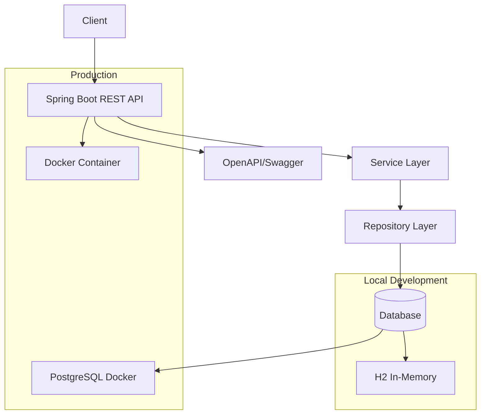

# Spring Boot Java Refresh

This project is a REST API backend service built with Spring Boot that handles subscriptions to Market Data from a Catalog. The service uses H2 database for local development and PostgreSQL for production deployments.

## Features

- REST API compatible with OpenAPI specification
- Market Data management (CRUD operations)
- Subscription management for Market Data
- H2 in-memory database for local development
- PostgreSQL database for production
- Docker containerization
- Comprehensive unit tests
- Spring Boot Actuator for monitoring

## Prerequisites

- Java 21 or higher
- Maven 3.6+
- Docker and Docker Compose (for production database)

## Getting Started

### Local Development (H2 Database)

1. Clone the repository
2. Run `mvn clean install` to build the project
3. Run `mvn spring-boot:run` to start the service
4. Run `mvn test` to execute unit tests

The service will be available at `http://localhost:8080`

### Production Setup (PostgreSQL Database)

1. Run `docker-compose up -d` to start the PostgreSQL database
2. Update `application.properties` to use PostgreSQL configuration
3. Run `mvn clean package` to build the JAR
4. Run `java -jar target/spring-boot-java-refresh-0.0.1-SNAPSHOT.jar`

## API Endpoints

### Market Data

- `GET /api/market-data` - Get all market data
- `GET /api/market-data/{id}` - Get market data by ID
- `GET /api/market-data/symbol/{symbol}` - Get market data by symbol
- `POST /api/market-data` - Create new market data
- `DELETE /api/market-data/{id}` - Delete market data by ID

### Subscriptions

- `GET /api/subscriptions` - Get all subscriptions
- `GET /api/subscriptions/{id}` - Get subscription by ID
- `GET /api/subscriptions/user/{userId}` - Get subscriptions by user ID
- `POST /api/subscriptions` - Create new subscription
- `DELETE /api/subscriptions/{id}` - Delete subscription by ID

## API Documentation

The API is documented using OpenAPI 3.0. Access the Swagger UI at `http://localhost:8080/swagger-ui.html` when the service is running.

## Database Configuration

### Local Development (H2)
- URL: `jdbc:h2:mem:marketdata`
- Console: `http://localhost:8080/h2-console`

### Production (PostgreSQL)
- URL: `jdbc:postgresql://localhost:5432/marketdata`
- Username: `postgres`
- Password: `password`

## Architecture



## Project Structure

```
src/
├── main/
│   ├── java/
│   │   └── com/example/springbootjavarefresh/
│   │       ├── controller/     # REST controllers
│   │       ├── entity/         # JPA entities
│   │       ├── repository/     # Data repositories
│   │       ├── service/        # Business logic
│   │       └── SpringBootJavaRefreshApplication.java
│   └── resources/
│       ├── application.properties
│       └── data.sql
└── test/                      # Unit tests
```

## Testing

Run unit tests with:
```bash
mvn test
```

## Building for Production

```bash
mvn clean package
java -jar target/spring-boot-java-refresh-0.0.1-SNAPSHOT.jar
```

## Docker

Build and run with Docker:
```bash
docker build -t spring-boot-java-refresh .
docker run -p 8080:8080 spring-boot-java-refresh
```

## Contributing

Please read CONTRIBUTING.md for details on our code of conduct and the process for submitting pull requests.

## License

This project is licensed under the MIT License - see the LICENSE file for details.
