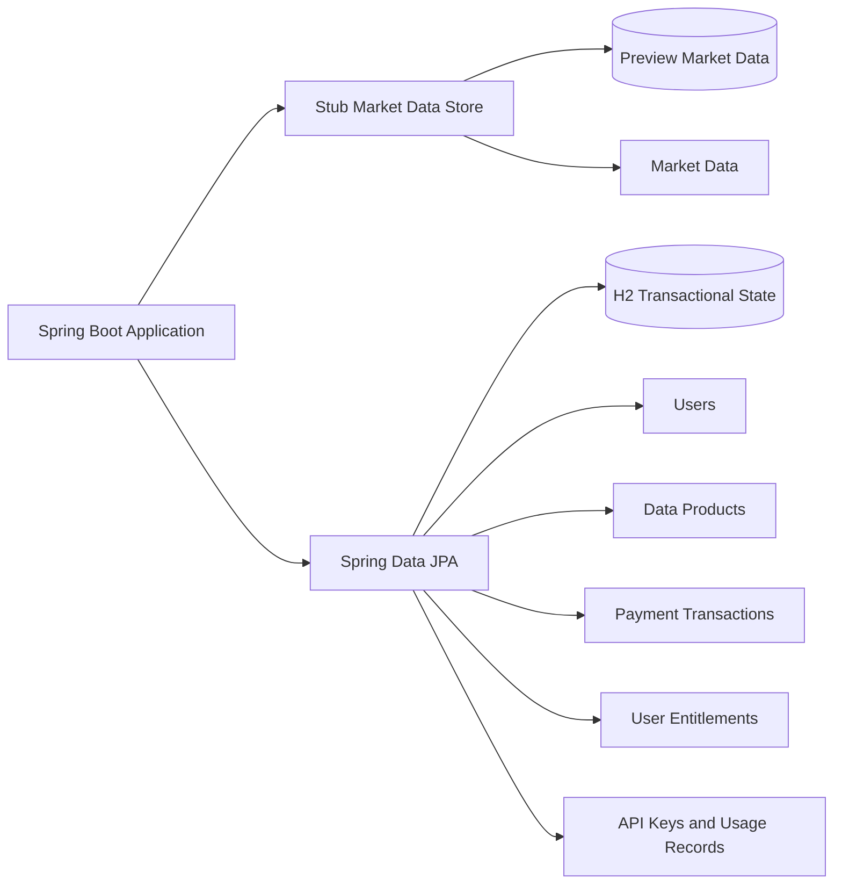

# ADR-0002 Diagram

Related documents:
- [Architecture Overview](../../ARCHITECTURE.md)
- [ADR-0002](../adr/0002-use-delta-lake-for-market-data-and-jpa-for-transactional-data.md)

```mermaid
graph LR
    Api[Spring Boot Application] --> StubStore[Stub Market Data Store]
    Api --> JPA[Spring Data JPA]
    StubStore --> Preview[(Preview Market Data)]
    JPA --> H2[(H2 Transactional State)]
    JPA --> Users[Users]
    JPA --> Products[Data Products]
    JPA --> Payments[Payment Transactions]
    JPA --> Entitlements[User Entitlements]
    JPA --> Keys[API Keys and Usage Records]
    StubStore --> Market[Market Data]
```
