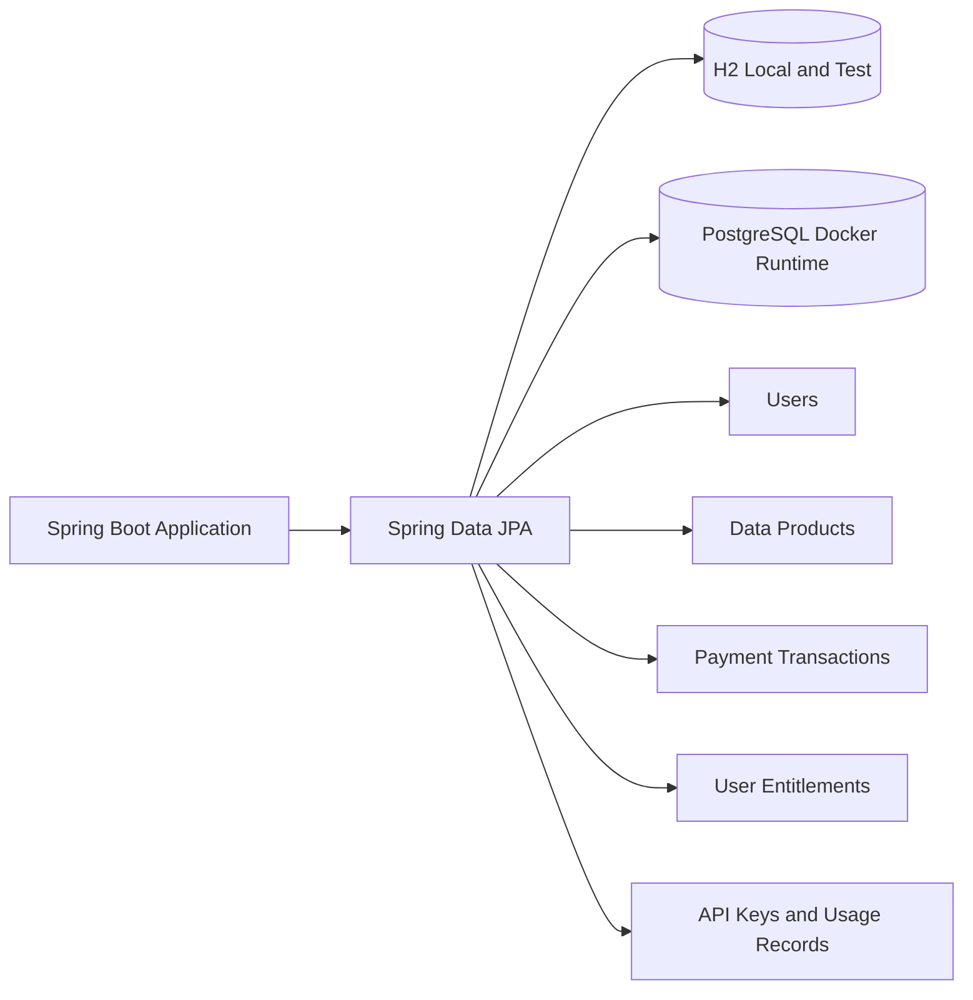

# ADR-0002 Diagram

Related documents:
- [Architecture Overview](../../ARCHITECTURE.md)
- [ADR-0002](../adr/0002-use-jpa-with-h2-and-postgresql.md)

```mermaid
graph LR
    Api[Spring Boot Application] --> JPA[Spring Data JPA]
    JPA --> H2[(H2 Local and Test)]
    JPA --> Pg[(PostgreSQL Docker Runtime)]
    JPA --> Users[Users]
    JPA --> Products[Data Products]
    JPA --> Payments[Payment Transactions]
    JPA --> Entitlements[User Entitlements]
    JPA --> Keys[API Keys and Usage Records]
```
