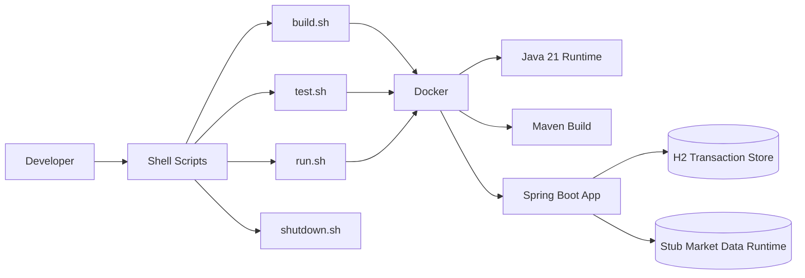

# ADR-0003 Diagram

Related documents:
- [Architecture Overview](../../ARCHITECTURE.md)
- [ADR-0003](../adr/0003-use-java-21-and-dockerized-build-test-runtime.md)

```mermaid
graph LR
    Dev[Developer] --> Scripts[Shell Scripts]
    Scripts --> Build[build.sh]
    Scripts --> Test[test.sh]
    Scripts --> Run[run.sh]
    Scripts --> Stop[shutdown.sh]
    Build --> Docker[Docker]
    Test --> Docker
    Run --> Docker
    Docker --> Java21[Java 21 Runtime]
    Docker --> Maven[Maven Build]
    Docker --> App[Spring Boot App]
    App --> H2[(H2 Transaction Store)]
    App --> Stub[(Stub Market Data Runtime)]
```
