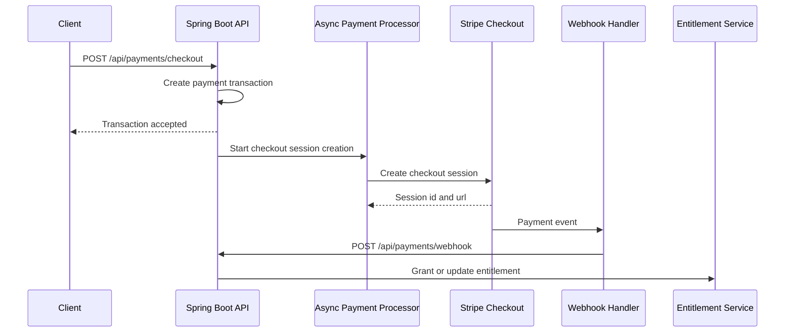

# ADR-0004 Diagram

Related documents:
- [Architecture Overview](../../ARCHITECTURE.md)
- [ADR-0004](../adr/0004-use-asynchronous-stripe-checkout-and-webhooks.md)

```mermaid
sequenceDiagram
    participant Client
    participant API as Spring Boot API
    participant Async as Async Payment Processor
    participant Stripe as Stripe Checkout
    participant Webhook as Webhook Handler
    participant Ent as Entitlement Service

    Client->>API: POST /api/payments/checkout
    API->>API: Create payment transaction
    API-->>Client: Transaction accepted
    API->>Async: Start checkout session creation
    Async->>Stripe: Create checkout session
    Stripe-->>Async: Session id and url
    Stripe->>Webhook: Payment event
    Webhook->>API: POST /api/payments/webhook
    API->>Ent: Grant or update entitlement
```
