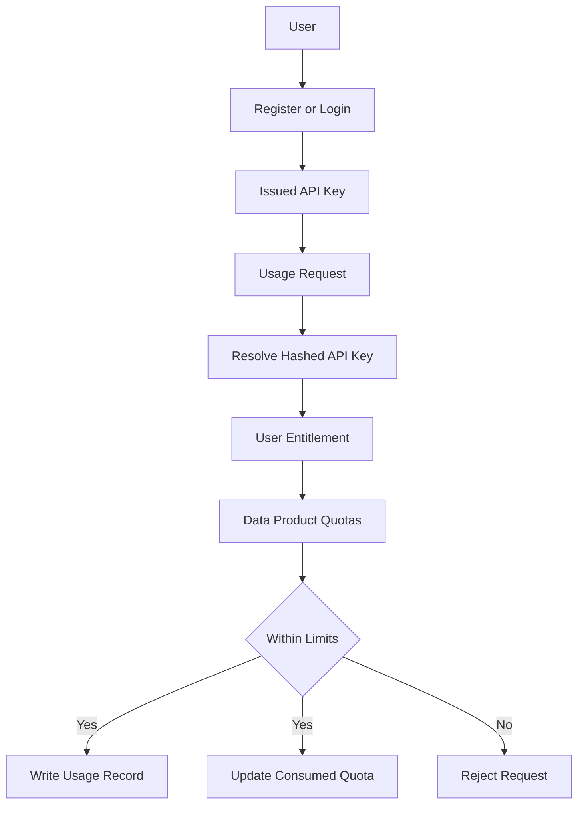

# ADR-0005 Diagram

Related documents:
- [Architecture Overview](../../ARCHITECTURE.md)
- [ADR-0005](../adr/0005-use-api-keys-with-entitlement-based-usage-limits.md)

```mermaid
graph TB
    User[User] --> Auth[Register or Login]
    Auth --> ApiKey[Issued API Key]
    ApiKey --> Usage[Usage Request]
    Usage --> Lookup[Resolve Hashed API Key]
    Lookup --> Entitlement[User Entitlement]
    Entitlement --> Product[Data Product Quotas]
    Product --> Decision{Within Limits}
    Decision -->|Yes| Record[Write Usage Record]
    Decision -->|Yes| Counters[Update Consumed Quota]
    Decision -->|No| Reject[Reject Request]
```
