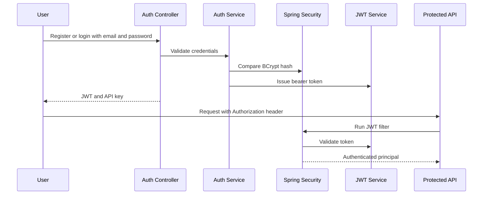

# ADR-0006 Diagram

Related documents:
- [Architecture Overview](../../ARCHITECTURE.md)
- [ADR-0006](../adr/0006-use-jwt-based-stateless-authentication.md)

```mermaid
sequenceDiagram
    participant User
    participant Auth as Auth Controller
    participant Service as Auth Service
    participant Security as Spring Security
    participant JWT as JWT Service
    participant API as Protected API

    User->>Auth: Register or login with email and password
    Auth->>Service: Validate credentials
    Service->>Security: Compare BCrypt hash
    Service->>JWT: Issue bearer token
    Auth-->>User: JWT and API key
    User->>API: Request with Authorization header
    API->>Security: Run JWT filter
    Security->>JWT: Validate token
    Security-->>API: Authenticated principal
```
