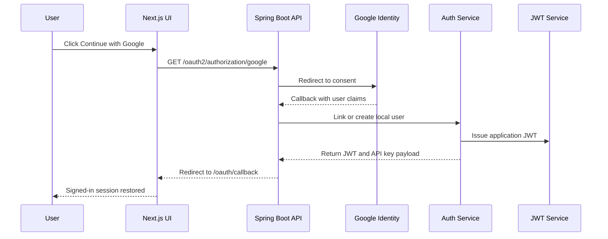

# ADR-0008 Diagram

Related documents:
- [Architecture Overview](../../ARCHITECTURE.md)
- [ADR-0008](../adr/0008-use-google-oauth2-login-with-jwt-session-bridging.md)

```mermaid
sequenceDiagram
    participant User
    participant UI as Next.js UI
    participant API as Spring Boot API
    participant Google as Google Identity
    participant Auth as Auth Service
    participant JWT as JWT Service

    User->>UI: Click Continue with Google
    UI->>API: GET /oauth2/authorization/google
    API->>Google: Redirect to consent
    Google-->>API: Callback with user claims
    API->>Auth: Link or create local user
    Auth->>JWT: Issue application JWT
    Auth-->>API: Return JWT and API key payload
    API-->>UI: Redirect to /oauth/callback#session
    UI-->>User: Signed-in session restored
```
