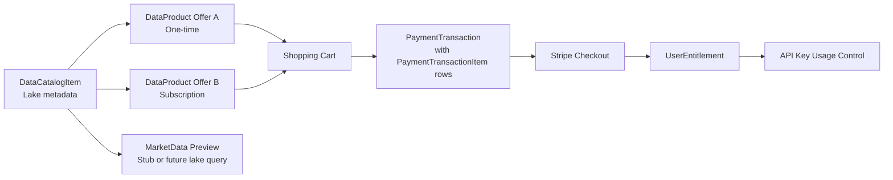

# ADR-0009 Diagram

Related ADR:
- [ADR-0009](../adr/0009-separate-catalog-items-from-sellable-offers-and-use-cart-checkout.md)

```mermaid
graph LR
    CatalogItem[DataCatalogItem\nLake metadata] --> OfferA[DataProduct Offer A\nOne-time]
    CatalogItem --> OfferB[DataProduct Offer B\nSubscription]
    CatalogItem --> Runtime[MarketData Preview\nStub or future lake query]
    OfferA --> Cart[Shopping Cart]
    OfferB --> Cart
    Cart --> Checkout[PaymentTransaction\nwith PaymentTransactionItem rows]
    Checkout --> Stripe[Stripe Checkout]
    Stripe --> Entitlement[UserEntitlement]
    Entitlement --> ApiKey[API Key Usage Control]
```
