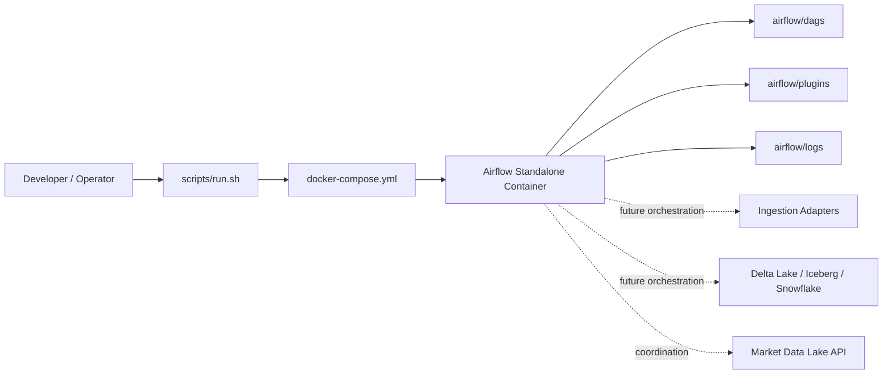

# ADR-0010 Diagram: Standalone Airflow Orchestration

Related ADR: [ADR-0010](../adr/0010-use-standalone-airflow-for-future-workflow-orchestration.md)

```mermaid
flowchart LR
    Dev[Developer / Operator] --> Scripts[scripts/run.sh]
    Scripts --> Compose[docker-compose.yml]
    Compose --> Airflow[Airflow Standalone Container]

    Airflow --> Dags[airflow/dags]
    Airflow --> Plugins[airflow/plugins]
    Airflow --> Logs[airflow/logs]

    Airflow -. future orchestration .-> Ingestion[Ingestion Adapters]
    Airflow -. future orchestration .-> Lake[Delta Lake / Iceberg / Snowflake]
    Airflow -. coordination .-> API[Market Data Lake API]
```
