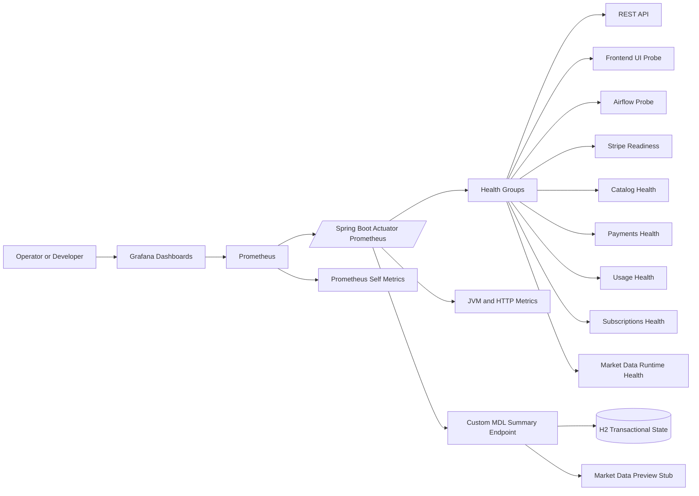

# ADR-0011 Diagram: Observability and Monitoring

Related ADR: [ADR-0011](../adr/0011-use-actuator-prometheus-and-grafana-for-local-observability.md)

```mermaid
flowchart LR
    User[Operator or Developer] --> Grafana[Grafana Dashboards]
    Grafana --> Prometheus[Prometheus]
    Prometheus --> Actuator[/Spring Boot Actuator Prometheus/]
    Prometheus --> PrometheusSelf[Prometheus Self Metrics]

    Actuator --> Health[Health Groups]
    Actuator --> Metrics[JVM and HTTP Metrics]
    Actuator --> Mdl[Custom MDL Summary Endpoint]

    Health --> Api[REST API]
    Health --> Ui[Frontend UI Probe]
    Health --> Airflow[Airflow Probe]
    Health --> Stripe[Stripe Readiness]
    Health --> Catalog[Catalog Health]
    Health --> Billing[Payments Health]
    Health --> Usage[Usage Health]
    Health --> Subs[Subscriptions Health]
    Health --> MarketData[Market Data Runtime Health]

    Mdl --> Db[(H2 Transactional State)]
    Mdl --> Stub[Market Data Preview Stub]
```
