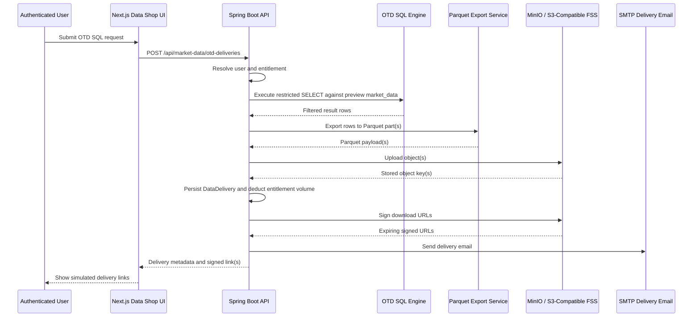

# ADR-0012 Diagram

Related documents:
- [ADR-0012](../adr/0012-use-s3-compatible-object-storage-and-synchronous-otd-deliveries.md)
- [Architecture Overview](../../ARCHITECTURE.md)

```mermaid
sequenceDiagram
    participant User as Authenticated User
    participant UI as Next.js Data Shop UI
    participant API as Spring Boot API
    participant SQL as OTD SQL Engine
    participant Export as Parquet Export Service
    participant FSS as MinIO / S3-Compatible FSS
    participant Mail as SMTP Delivery Email

    User->>UI: Submit OTD SQL request
    UI->>API: POST /api/market-data/otd-deliveries
    API->>API: Resolve user and entitlement
    API->>SQL: Execute restricted SELECT against preview market_data
    SQL-->>API: Filtered result rows
    API->>Export: Export rows to Parquet part(s)
    Export-->>API: Parquet payload(s)
    API->>FSS: Upload object(s)
    FSS-->>API: Stored object key(s)
    API->>API: Persist DataDelivery and deduct entitlement volume
    API->>FSS: Sign download URLs
    FSS-->>API: Expiring signed URLs
    API->>Mail: Send delivery email
    API-->>UI: Delivery metadata and signed link(s)
    UI-->>User: Show simulated delivery links
```
