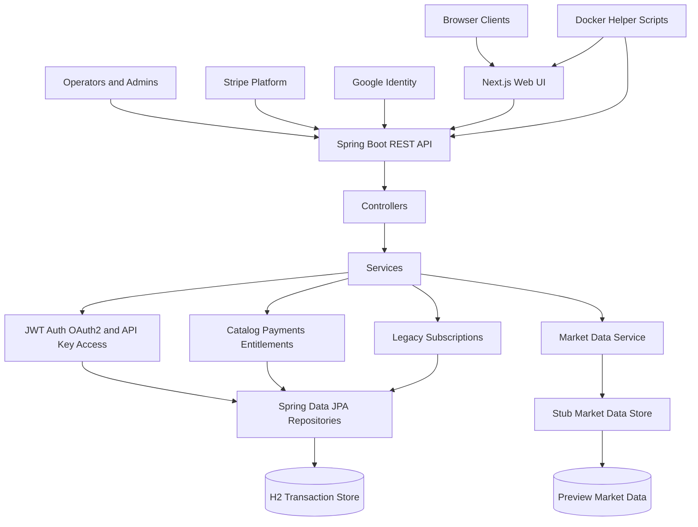

# Architecture Overview Diagram

Related documents:
- [Architecture Overview](../../ARCHITECTURE.md)
- [Architecture Decision Records](../adr)

```mermaid
graph TB
    Client[Browser Clients] --> Next[Next.js Web UI]
    Admin[Operators and Admins] --> Api
    Stripe[Stripe Platform] --> Api
    Google[Google Identity] --> Api
    Next --> Api[Spring Boot REST API]
    Api --> Controllers[Controllers]
    Controllers --> Services[Services]
    Services --> Security[JWT Auth OAuth2 and API Key Access]
    Services --> Commerce[Catalog Payments Entitlements]
    Services --> Market[Market Data Service]
    Services --> Legacy[Legacy Subscriptions]
    Security --> Repositories[Spring Data JPA Repositories]
    Commerce --> Repositories
    Legacy --> Repositories
    Market --> StubStore[Stub Market Data Store]
    StubStore --> Preview[(Preview Market Data)]
    Repositories --> H2[(H2 Transaction Store)]
    Scripts[Docker Helper Scripts] --> Api
    Scripts --> Next
```
